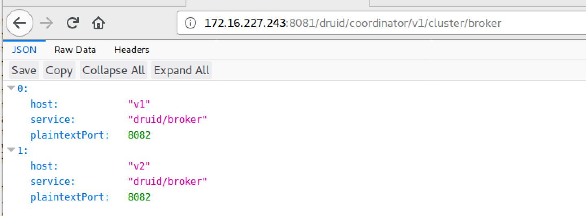

https://imply.io/

https://docs.imply.io/2.7/on-prem/quickstart

```bash
# 单机启动
bin/supervise -c conf/supervise/quickstart.conf

# log文件 var/sv/
```

## 环境要求

* Java8
* node
* git lfs

## 单机部署

服务启动采用`systemctl`, 见本项目`service`文件夹

```bash
git clone https://github.com/doctording/imply-2.7.8
git lfs pull
```

* http://172.16.227.243:8081/
* http://172.16.227.243:8090/

## 多机部署

### 新增broker节点, 同理其它

```bash
# 172.16.227.129
rsync -avz imply-2.7.8/ root@172.16.227.129:/usr/local/imply-2.7.8/
```

zookeeper设置，其它文件保持跟`172.16.227.243`一致

```bash
# /usr/local/imply-2.7.8/conf-quickstart/druid/_common/common.runtime.properties
druid.zk.service.host=172.16.227.243
druid.zk.paths.base=/druid
```

```bash
bin/supervise -c conf/supervise/broker.conf
```

ifconfig | hostname
- | -
172.16.227.243 | v1
172.16.227.129 | v2


